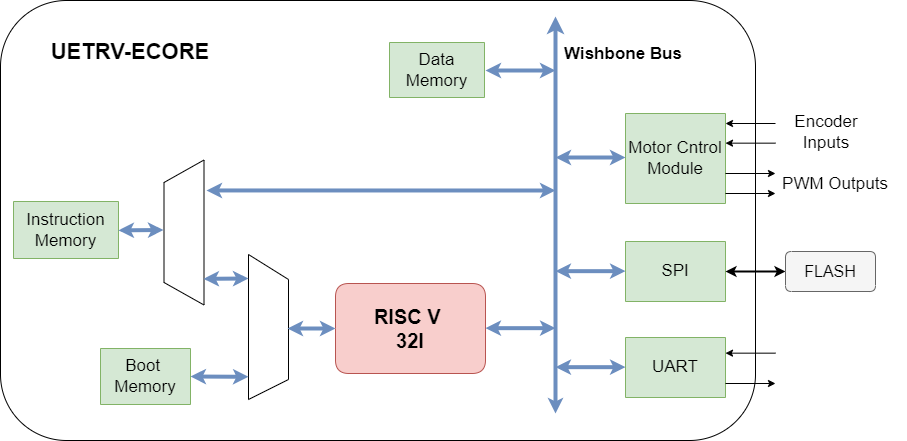

## UETRV-ECORE  
UETRV-ECORE is a RISC-V based SoC derived from [UETRV_ESoC](https://github.com/ee-uet/UETRV_ESoC) with modified memory connectivity for Openlane flow.   

### Block Diagram

The verilog rtl used in this repo is generated from Scala source, available [here](https://github.com/ee-uet/UETRV_ESoC). Further details about the peripheral memory map, bootloader, example programs, testbenches etc. are also provided in that repo. 
